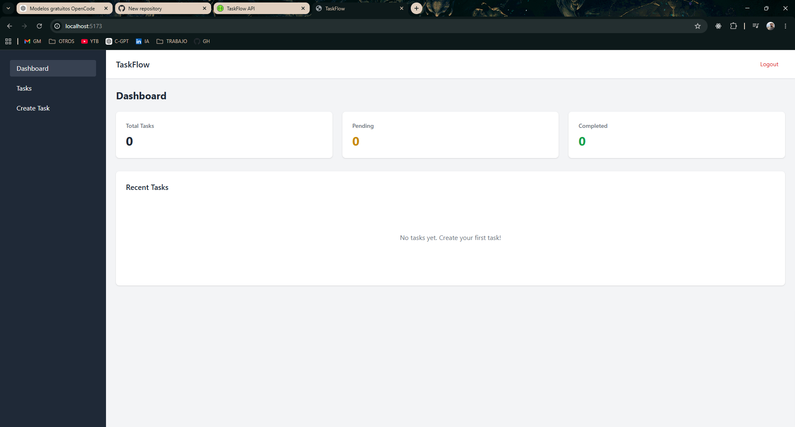
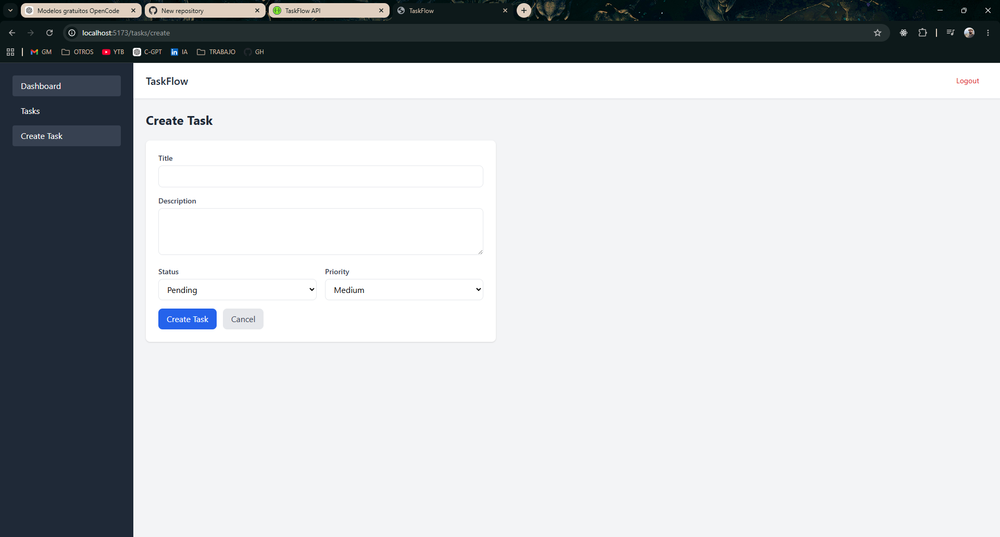

# TaskFlow Frontend

Vue 3 frontend for TaskFlow, a fullstack task management application.


## Features

- Vue 3 Composition API
- Pinia state management
- Vue Router with protected routes
- Axios with JWT interceptors
- Automatic token refresh
- TailwindCSS styling
- Loading and empty states
- Docker + Nginx deployment

## Architecture

```
taskflow-frontend/
├── src/
│   ├── components/    # Reusable UI components
│   ├── layouts/       # Auth and Dashboard layouts
│   ├── router/        # Vue Router configuration
│   ├── services/      # Axios API client
│   ├── stores/        # Pinia stores (auth, tasks)
│   ├── views/         # Page components
│   ├── App.vue
│   └── main.js
├── Dockerfile
├── docker-compose.yml
├── nginx.conf
└── vite.config.js
```

## Technologies

| Technology | Version |
|---|---|
| Vue | 3.4.21 |
| Vite | 5.2.0 |
| Vue Router | 4.3.0 |
| Pinia | 2.1.7 |
| Axios | 1.6.8 |
| TailwindCSS | 3.4.3 |

## Quick Start

### Development

```bash
# Install dependencies
npm install

# Copy environment variables
cp .env.example .env

# Start dev server
npm run dev
```

Frontend runs at: `http://localhost:5173`

### Docker (Production)

```bash
# Build and run
docker-compose up --build
```

Frontend serves at: `http://localhost:80` (Nginx)

## Environment Variables

| Variable | Description | Default |
|---|---|---|
| `VITE_API_BASE_URL` | Backend API URL | `http://localhost:8000/api` |

## Project Structure

### Stores

| Store | Purpose |
|---|---|
| `auth` | Login, register, logout, token management |
| `tasks` | Task CRUD operations |

### Routes

| Path | Component | Auth Required |
|---|---|---|
| `/auth/login` | LoginPage | No |
| `/auth/register` | RegisterPage | No |
| `/` | DashboardPage | Yes |
| `/tasks` | TasksListPage | Yes |
| `/tasks/create` | CreateTaskPage | Yes |
| `/tasks/:id/edit` | EditTaskPage | Yes |

### Components

| Component | Purpose |
|---|---|
| `TaskCard` | Display task with status/priority badges |
| `TaskForm` | Reusable create/edit form |
| `LoadingSpinner` | Loading state indicator |
| `EmptyState` | Empty data placeholder |
| `Navbar` | Top navigation with logout |
| `Sidebar` | Sidebar navigation links |

## Authentication Flow

1. User logs in via `LoginPage`
2. JWT tokens stored in `localStorage`
3. Axios interceptor attaches `Authorization` header to all requests
4. On 401, interceptor auto-refreshes token using refresh token
5. If refresh fails, user is redirected to login

## Screenshots

### Dashboard



### Task List



## License

MIT
